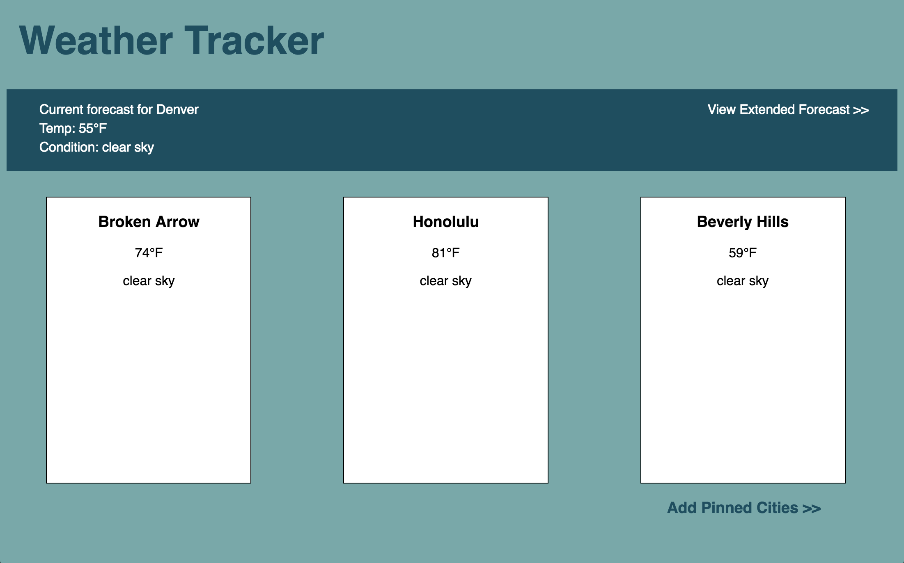

# React/Router/Redux Weather Forecast Application

## Setup
This project template was built with [Create React App](https://github.com/facebookincubator/create-react-app).

<strong>`npm install`</strong>  
<strong>`npm start`</strong>  
Runs the app in the development mode. 
Open [http://localhost:3000](http://localhost:3000) to view it in the browser.

## Application Description

This weather application fetches data from the OpenWeatherMap API. The Geolocation API is used to determine the current weather in your city and is displayed in the header. You can extend your current weather to a 5 day/3 hour forecast by clicking on the "View Extended Forecast" link. To get back to the dashboard page you can click the back arrow in the browser or click on the title. The dashboard displays cards that show the forecast of cities based on the user's selection. The user can click on the card that states "Pin another city" or can click on the "Add Pinned Cities" link to input a zip code of the city of their choice. After submitting the zip code the user will need to navigate back to the dashboard in order to see their card rendered with the city forecast they requested. 
